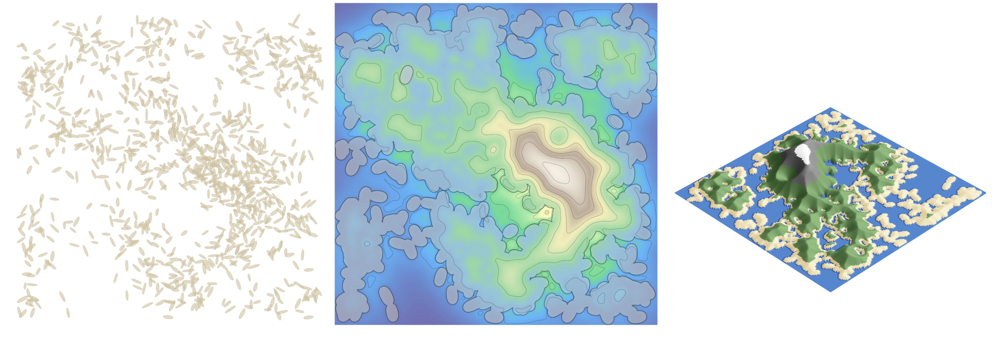

# rice2topography  
**Procedural worldbuilding from grains of rice**

---

### Overview  
`rice2topography` is a generative terrain builder that turns clusters of “rice grains” into landmasses, heightmaps, and 3D topographic renders. [Buildilng off of other people's artistic interests using rice to make fantasy maps](https://thecozyartteacher.com/how-to-make-a-rice-fantasy-map/), each run creates a unique, organic island, formed not from perlin noise or fractals, but from simulated scatterings of rice-shaped geometry. The density of grains determines the “elevation,” smoothed by Gaussian filters and shaded.

---

### Concept  
> “What if a spilled bowl of rice could become a continent?”

1. **Scatter grains** — thousands of rice-shaped polygons are generated with random rotation, size jitter, and clustering.  
2. **Merge & buffer** — the grains fuse into a continuous outline (your landmass).  
3. **Density field** — KDE (kernel density estimation) transforms local grain density into elevation.  
4. **Fade & smooth** — edge blending mimics coastal erosion and continental shelves.  
5. **Color & render** — the result becomes a shaded 3D landscape with grass, rock, and snow layers.  

The result is both procedural and natural.
